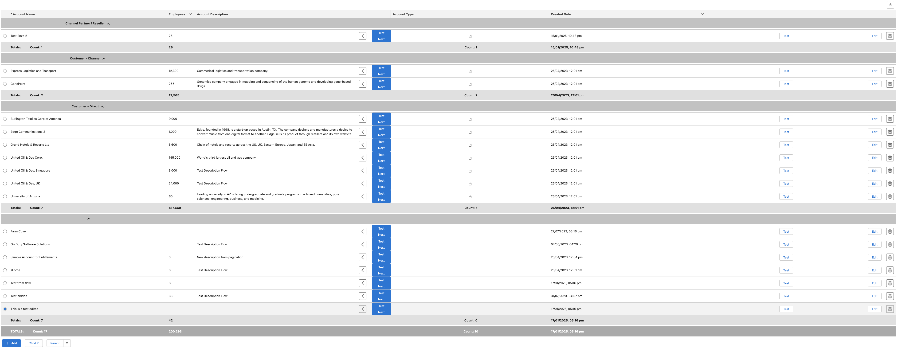

# OnDuty Enhanced Datatable

Lightning Web Component to use in a Flow Screen, Lightning Record pages and Experience Cloud.

## Documentation

- [Columns and Data](docs/ColumnsAndData/README.md)
- [Pagination](docs/Pagination/README.md)
- [Selection](docs/Selection/README.md)
- [Grouping and Summarize](docs/GroupingAndSummarize/README.md)
- [Creation, Edition and Deletion](docs/AddEditDelete/README.md)
- [Saving](docs/Saving/README.md)
- [Automatic Refresh](docs/AutomaticRefresh/README.md)
- [Export](docs/Export/README.md)
- [Copy / Paste Configuration](docs/CopyAndPasteConfiguration/README.md)
- [Record Pages and Experience Cloud Pages](docs/RecordAndExperienceCloud/README.md)

**NOTE**: There is a _Preview_ button in the configuration for you to preview while building the table.

## Support

If you want to support my work, feel free to buy me a coffee 😀

## Installation

## Example Datatable In Use

