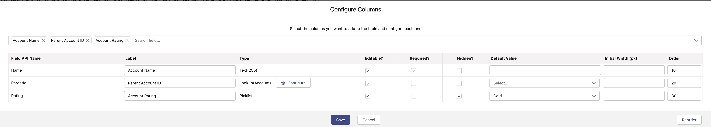
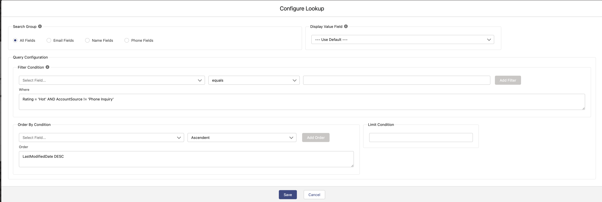
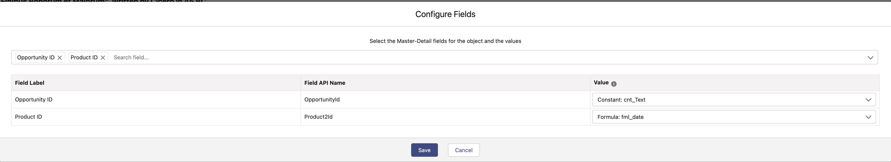

# OnDuty Enhanced Flow Datatable

Lightning Web Component to use in a Flow Screen that allows to display a list of records in a Table, you can update them, delete them or add new ones.
If `Save Enabled` is false, it outputs 3 collections, one with the added records, one with the edited records and one with the delete records, so you can use them with the right action in the Flow.
If `Save Enabled` is true, 2 buttons will appear to save the changes or cancel. If `Navigate Next after Save` is enabled then the flow will navigate to next element and it will output the variable `saveAndNext` as true.

## Where can I use it?

You can use this component in Flow screens.

## Properties

It has a custom editor that allows you to specify the Object, the columns, the source data and different properties.

##### It supports the edition of the following field types

- Checkbox
- Currency
- Date
- Date/Time
- Email
- Integer
- Long Text Area
- Lookup
- Number
- Picklist (Multi-Select)
- Percent
- Phone
- Rich Text Area
- Picklist
- Text
- Text Area
- URL

##### And besides you can also show these

- Address
- Id

##### For each of these type of fields you can

- Change the Label it shows.
- Specify a Default Value
- Specify if it's Editable or not
- Specify if it's Required or not
- Specify if it's hidden or not
- The Width of the column
- The Order of the column in the table
- If it's a lookup field you can configure:
  - Search Group (to use in the SOSL query when searching)
  - Display value field (if empty Name field will be used)
  - An optional Filter condition
  - An optional Order By condition
  - An optional Limit condition

## Other configurations

- You can show or hide the **Add** button (and change it's label)
- You can show or hide the **Delete** icon per row
- You can show or hide the **Bulk Delete** button (and change it's label). This will make the table selectable.
- You can deactivate the **Edition** of the table as a whole.
- You can show or hide the **Bulk Edit** button (and change it's label). This will open a popup with the editable fields of the table and it will update all the selected rows with the same values.
- You can show or hide the **Save and Cancel** buttons to make the table to save the changes (you can change the Save button label).
- You can have an `Inline Add` which it will add a row to the table or a `Flow Add` which it will open a flow to add a record. This flow needs to output a SObject variable called `recordOutput` with the same object as the source of the table. You can also specify extra Flow Input variables.
- You can have an `Inline Edit` which it will make the table editable or a `Flow Edit` which it will open a flow to edit a record. This flow needs to receive a `recordId` variable with the id of the record to edit and it needs to output a SObject variable called `recordOutput` with the same object as the source of the table. You can also specify extra Flow Input variables. NOTE: If edit is with a Flow then add **MUST** be with a Flow.
- You can specify the Master/Detail field/s that will be populated on creation of new records.
- You can specify if you want to navigate to next node in the flow if Inline Save is enabled.
- You can specify a Message when no records are found.

## Live Demo

Live Demo on a Scratch Org: <a href="https://hosted-scratch.herokuapp.com/launch?template=https://github.com/ondutysoftwaresolutions/oddatatable">CLICK HERE</a>

## Installation

## Screenshots

### Configuration screens

#### Generic Table Configurations

#### Columns Configuration

#### Lookup Configuration

#### Master-Detail Configuration

### Datatable In Use

