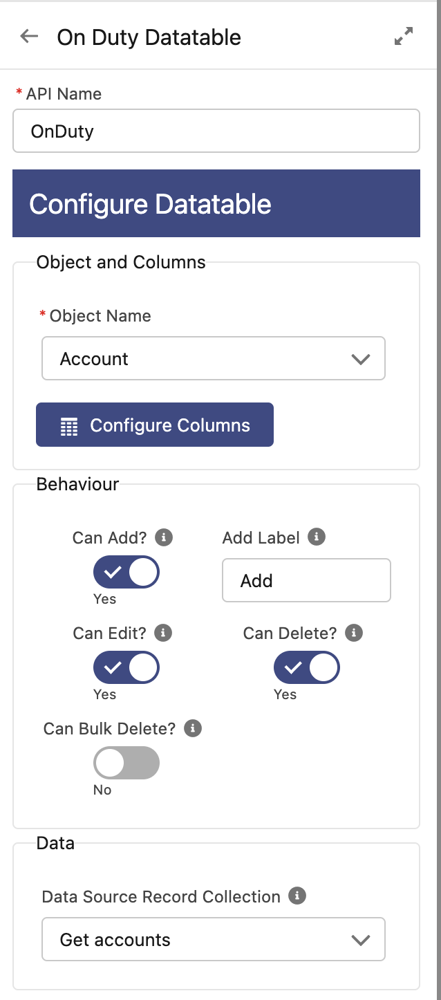
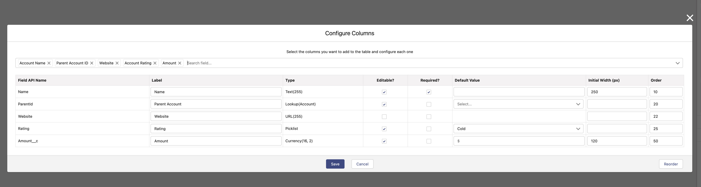
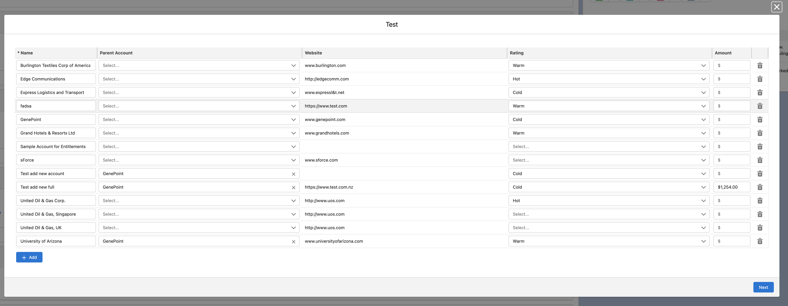

# OnDuty Enhanced Flow Datatable

Lightning Web Component to use in a Flow Screen that allows to display a list of records in a Table, you can update them, delete them or add new ones.
It outputs 3 collections, one with the added records, one with the edited records and one with the delete records, so you can use them with the right action in the Flow.

## Where can I use it?

You can use this component in Flow screens.

## Properties

It has a custom editor that allows you to specify the Object, the columns, the source data and some properties.

##### It supports the edition of the following field types:

- Checkbox
- Currency
- Date
- Date/Time
- Email
- Integer
- Long Text Area
- Lookup
- Number
- Picklist (Multi-Select)
- Percent
- Phone
- Rich Text Area
- Picklist
- Text
- Text Area
- URL

##### And besides you can also show these:

- Address
- Id

##### For each of these type of fields you can:

- Change the Label it shows.
- Specify a Default Value
- Specify if it's Editable or not
- Specify if it's Required or not
- The Width of the column
- The Order of the column in the table

## Other configurations

- You can show or hide the **Add** button (and change it's label)
- You can show or hide the **Delete** icon per row
- You can show or hide the **Bulk Delete** button (and change it's label). This will make the table selectable.
- You can deactivate the **Edition** of the table as a whole.

## Live Demo

Live Demo on a Scratch Org: <a href="https://hosted-scratch.herokuapp.com/launch?template=https://github.com/ondutysoftwaresolutions/oddatatable">CLICK HERE</a>

## Installation

## Screenshots

### Configuration screens

#### Generic Table Configurations

#### Columns Configuration

### Datatable In Use

