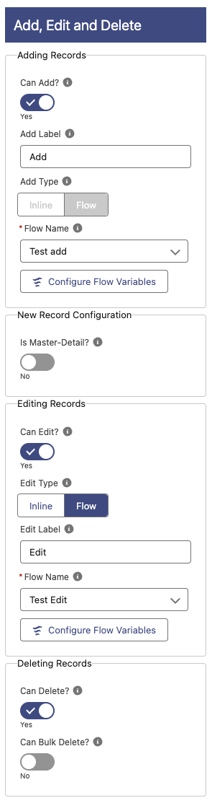
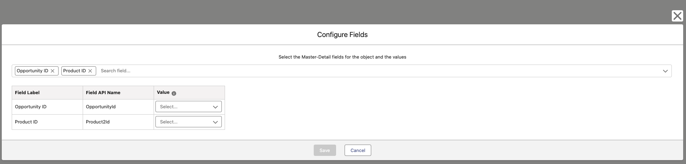

# Add, Edit and Delete

## Adding Records

**Can Add?**: Enable the addition of records in the table.
**Add Label**: Label to show in the Add button, if empty, it will only show the icon.
**Add Type**: Specify whether you want to be able to add the data directly in the table (Inline) or with a Flow.

- _NOTE_: If Edit is with a flow, then Add must be with a Flow, but not vice versa.

**Flow Name**: Only displayed if **Add Type** is _Flow_. Screen flow name to fire whenever the Add Button is clicked, then you need to select the Flow here and Configure Flow Variables.

- _NOTE_: A **recordOutput** SObject record Output variable is needed.

## New Record Configuration

**Is Master-Detail?**: Is this the detail object on a Master-Detail relationship? If so, you will need to specify the fields and the values for the parent/s.

If the above is enabled, the **Configure Master-Detail Fields** button will appear and clicking on it will open the Configure Fields popup.

### Configure Fields

- Select the fields you want to prepopulate when creating records, this selection will only bring Master-Detail relationship fields.
- Select the Variable, Constant or Formula that contains the value to use in that Master-Detail field.

_NOTE_: You can only include up to 2 Master-Detail Fields.

## Editing Records

**Can Edit?**: Enable the editing of records in the table.
**Edit Type**: Specify whether you want to be able to edit the data directly in the table (Inline) or with a Flow.

- _NOTE_: If Edit is with a flow, then Add must be with a Flow, but not vice versa.

**Edit Label**: Label to show in the Edit button when Editing with a flow.

**Flow Name**: Only displayed if **Edit Type** is _Flow_. Screen flow name to fire whenever the edit button in the row is clicked, then you need to select the Flow here and Configure Flow Variables.

- _NOTE_: A **recordId** Input Variable and a **recordOutput** SObject record Output variable are needed.

**Can Bulk Edit?**: Only displayed if **Edit Type** is _Inline_. Add a selection and a button to edit several lines at one time. This will enable the selection of the table with Multiple Rows.
**Bulk Edit Label**: Only displayed if **Edit Type** is _Inline_ and **Can Bulk Edit** is enabled. Label to show in the Bulk Edit button, if empty, it will only show the icon.

## Deleting Records

**Can Delete?**: Enable the deletion of records in the table.
**Can Bulk Delete?**: Add a selection and a button to delete several at one time. This will enable the selection of the table with Multiple Rows.
**Bulk Delete Label**: Only displayed if **Can Bulk Delete** is enabled. Label to show in the Bulk Delete button, if empty, it will only show the icon.
