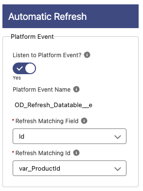

# Automatic Refresh

**Listen to Platform Event?**: If enabled, the component will listen to the OD_Refresh_Datatable\_\_e Platform Event and refreshes itself when there is matching Id.
**Platform Event Name**: The API Name of the Platform Event that needs to be published for the component to refresh
**Refresh Matching Field**: The fieldName to use when matching and refreshing with Platform event. This field must be in the data source collection.
**Refresh Matching Id**: Variable, Constant, formula etc, that contains the matching id to use when refreshing with Platform event.
