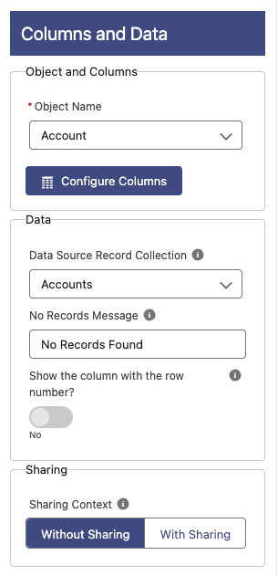

# Columns and Data

## Object and Columns

**Object Name**: Select the object to use for the source of the table
**Configure Columns**: See section below **Columns**

## Data

**Data Source Record Collection**: The source of the data to use. This is used in Flows only.
**No Records Message**: A message to show when there are no records in the Data Source or there is not a data source specified.
**Show the column with the row number?**: If enabled, an extra column at the beginning will be added to show the number of the row. This will only work if grouping is disabled and there are no summarized columns.

## Sharing

**Sharing Context**: The component runs Without Sharing by default but you can change it here to run With Sharing.
