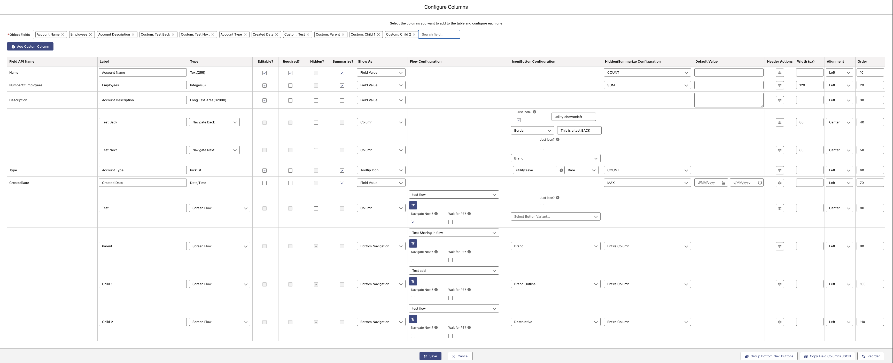
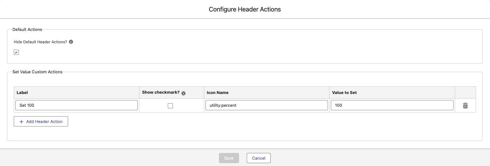
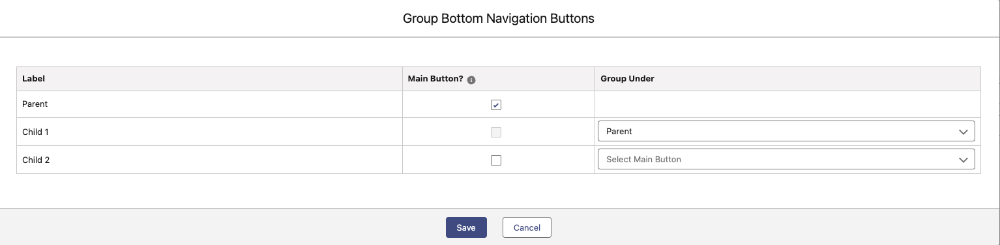
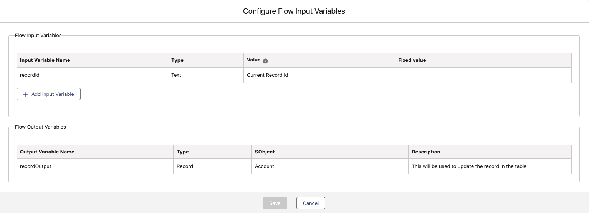
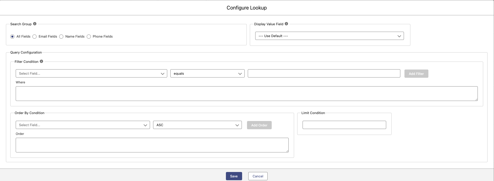

# Columns

- Here you can specify the columns of the object selected you want to include in the component.
- You can also specify custom columns, these could be buttons (shown as another column, or as a button below the table or both).

## Object Column

For each object column you can specify:

- **Label**: The label to show or identify the column
- **Type**: If the type is Lookup see the **Lookup Configuration** below
- **Editable**: Is the column editable? This will take into account the permissions of the user running it, but also if the field is editable at all. e.g. formulas are not editable.
- **Required**: Is this column required when saving. Again this will also default to the requiredness of the field in Salesforce object.
- **Hidden**: Hide this column?. If hidden, you can specify the behaviour (see **Hidden/Summarize Configuration** below). Also if hidden it cannot be summarized.
- **Summarize**: Summarize this column. If summarize, you can specify the behaviour (see **Hidden/Summarize Configuration** below). Also if summarized it cannot be hidden.
- **Show As**: How to show this column.
  - _Field Column_: Show the data as you will see it in Salesforce.
  - _Tooltip Icon_: Show an icon instead of the data and the content of the field will be displayed in the tooltip (see **Icon/Button Configuration** below for customizations).
- **Icon/Button Configuration**: For columns, only Icon Configuration is relevant. If **Show As** is _Tooltip Icon_, then you can specify here the icon and the variant of the icon. You can use custom icons here, but you need to store it in the static resource OD_Datatable/icons and reference the name here. e.g. icon.svg
- **Hidden/Summarize Configuration**:
  - _Hidden_: You can specify here if you want to hide the _Entire Column_ or if it is _Record Based_. For _Record Based_, you need to select a checkbox field in the object that drives the hide/show of the value.
  - _Summarize_: You must specify here the type of summarization to do, options are: COUNT, AVG, SUM, MAX and MIN, but you will only see relevant options based on the type of field.
- **Default Value**: Use this as a default value when creating new records.
- **Header Actions**: Specify header actions for the column (see **Header Actions** below)
- **Width (px)**: The initial width for the column
- **Alignment**: The Alignment for the content of the column.
- **Order**: The order of the column to show. You can change this number and click Reorder button to see the changes, otherwise it will be reordered on Save.

### Header Actions

- **Hide Default Header Actions?**: This is to specify if we want to show the default header actions of the datatable or not. Default options are Wrap text and Clip Text.
- **Set Value Custom Actions**: Add an option to set a value to the whole column. This is the only type of header action supported for now.
  - _Label_: The label to show in the option
  - _Show checkmark?_: Show a checkmark to the left of the label
  - _Icon Name_: Show an icon to the right of the label
  - _Value to Set_: The value to set to the column, this will only allow values of the same type than the column

## Custom Column

For each custom column you can specify:

- **Label**: The label to show or identify the column
- **Type**: The type of the custom column to show. Options are: Autolaunched Flow, Screen Flow, Navigate Next, Navigate Back, Send to Caller, Checkbox Field, Currency Field, Date Field, Number Field, Percentage Field, Text Field and Toggle Field (see **Custom Type Notes** below).
- **Editable**: Custom Columns: Checkbox Field, Currency Field, Date Field, Number Field, Percentage Field, Text Field and Toggle Field are always Editable, otherwise they are always not editable.
- **Required**: These columns are never required.
- **Hidden**: Same as Object Columns.
- **Summarize**: Same as Object Columns.
- **Show As**: How to show this column. For Non Button custom types, the only option is _Column_. For Buttons these are the options:
  - _Column_: Show the Custom Column as an extra column in the table
  - _Bulk Button_: Show a Button at the bottom of the table with the exta word in the label 'Bulk'. This will enable the selection of the table.
  - _Column and Bulk Button_: Both of the previous options together, so show it as a column and as a bulk button too.
  - _Bottom Navigation_: This will show a button also at the bottom of the table, but it does not mean the selection will be enabled, this could be use to call subflows e.g. This type of buttons can be Grouped (see **Group Navigation Buttons** below)
- **Flow Configuration**: Only Relevant if Screen Flow or Autolaunched Flow are selected. Here you need to specify the flow to open, the variables (see **Flow Input/Output Variables** below) and if you want to Navigate Next after the flow finishes or if we want to wait for a Platform Event to refresh the data (it will show a spinner until a platform event is received. Used in conjunction with the Listen to Platform Event setting).
- **Icon/Button Configuration**: For custom columns, only Button Configuration is relevant. You can choose to display Just an icon, in which case, you can specify the icon, the variant and the tooltip. Otherwise a button will be displayed and you can specify the Variant.
- **Hidden/Summarize Configuration**:
  - _Hidden_: Only relevant for Custom Columns that are fields. Same configuration as Object Columns.
  - _Summarize_: Custom columns cannot be summarized.
- **Default Value**: Only relevant for Custom Columns that are fields. You can specify a Default Value based on a field on the record, with the format {{Record.Name}}.
- **Header Actions**: Same as Object Columns.
- **Width (px)**: Same as Object Columns.
- **Alignment**: Same as Object Columns.
- **Order**: Same as Object Columns.

### Custom Type Notes

- **Autolaunched Flow**: This will open an autolaunched flow.
- **Screen Flow**: This will open a screen flow.
- **Navigate Next**: This will navigate next in the current flow (where the datatable is used). Only work if using inside a flow.
- **Navigate Back**: This will navigate back in the current flow (where the datatable is used). Only work if using inside a flow.
- **Send to Caller**: This will send the current record to a listening caller. Used if including the datatable inside another LWC (the event must be called onclickrowbutton).
- **Field Types**: This will show a column with that field type.

### Group Navigation Buttons

This will show you a list of all the Bottom Nav Buttons that you created in the previous screen (Custom Columns).
Here you can specify how to group the Bottom Navigation Buttons. First select which ones are Main Buttons, and then you will be able to select those Main Buttons in other buttons (Group Under.)

### Flow Input/Output Variables

These screen will show you the mandatory Inputs and Outputs variables for flows.

#### Flow Input Variables

- **recordId**: This is mandatory, as it will send the current record id to the flow.
- **Other Variables**: You can add as many Input variables as you want, you need to specify the name, type and you can specify a variable with the value or a fixed value to send to the flow.

#### Flow Output Variables

- **recordOutput**: This is mandatory if you want to refresh the table after the flow finishes. A variable recordOutput must be returned by the flow and it must be a Record variable of the same type (object name) than the one we have in the table configuration.

### Lookup Configuration

This will do a SOSL search to only get the records that matches the criteria specified.

- **Search Group**: Search in All Fields, Email Fields, Name Fields or Phone Fields.
- **Display Value Field**: Select the Field to display in the dropdown.
- **Query Configuration**:
  - _Filter Condition_: This is to build the query to filter the records, you can manually build the query in the _Where_ box or you can use the _Add filter_ to build it. Important note is that the _Add Filter_ always use the **AND** condition so if you need to use **OR**, you will need to manually change it.
  - _Order By Condition_: This is to build the order by for the query, you can manually build the order by in the _Order_ box or you can use the _Add Order_ to build it.
  - _Limit Condition_: Specify a limit to only return that number of records as a maximum.

### Copy Field Configuration JSON Button

This button will copy the JSON of the columns into the Clipboard, in case you need it.
