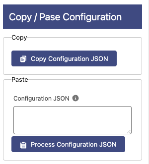

# Copy and Paste Configuration

## Copy

Clicking this button will copy the configuration in a JSON format into the Clipboard, you can use this to duplicate the table easily or use the same configuration in a different flow e.g.

It is also used to take the configuration and paste it in the Custom Metadata **OD_Datatable_JSON_Configuration\_\_mdt** to be able to use this component in Lightning Record Pages and Experience Cloud.

## Paste

**Configuration JSON**: Paste a fully-configured JSON from another Datatable (Using the Copy Configuration JSON button).

Clicking the **Process Configuration JSON** will process the JSON pasted above and configure the table with it.
