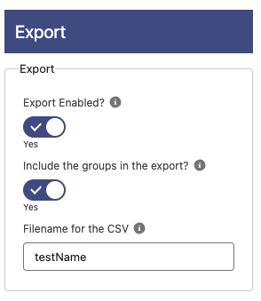

# Export

**Export Enabled?**: If enabled a button will be displayed at the top right corner of the table to export the data to a CSV
**Include the groups in the export?**: If enabled an extra column will be added to the CSV with the group name. Only works if the grouping is enabled.
**Filename for the CSV**: This is the filename that will be used when exporting (without the csv extension). If nothing specified the filename will be dataExport.csv
