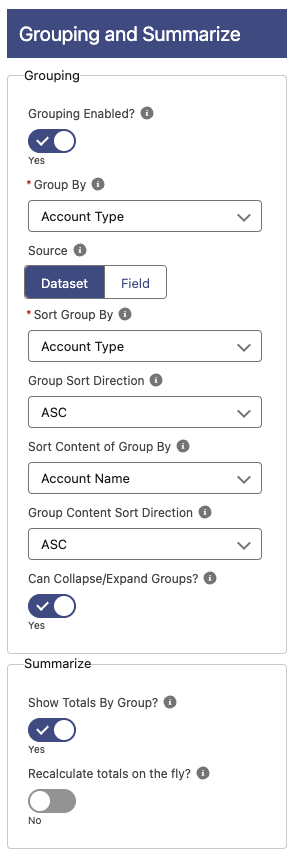

# Grouping and Summarize

## Grouping

**Grouping Enabled**: Enable grouping of rows or not.
**Group By**: Field to group the data by. If the field is not present in the dataset then it will not group the data.
**Source**: Specify whether you want the grouping to be based on data from the source data or grouping by a picklist field options. If Field, then you can select to show/hide the empty groups. If Dataset, then it will only show the ones with data and the records without it as a last group.
**Show Empty?**: If enabled, the groups with no data in it will be shown. Only displayed if the Source selected is Field.
**Sort Group By**: Field to sort the group the data by. It can be the Grouping field or any of the summarized columns (if any). Default is the Grouping Field.
**Group Sort Direction**: Order the groups ASC (A-Z, 0-9, Oldest dates first) or DESC (Z-A, 9-0, Newest Dates first). Default is ASC.
**Sort Content of Group By**: Field to sort the content of the group by. It can be one of the fields being shown in the table.
**Group Content Sort Direction**: Order the content of the group ASC (A-Z, 0-9, Oldest dates first) or DESC (Z-A, 9-0, Newest Dates first). Default is ASC.
**Can Collapse/Expand Groups?**: If enabled you can click on the group row to collapse or expand. All calculations will include the collapsed rows, and if you change/add/delete a row, then collapse it and save, then it will still save the changed rows.

## Summarize

This section is only shown if there is at least 1 summarized column.

**Show Totals By Group?**: If enabled, a line with the totals by group will be shown. Only visible if grouping is enabled.
**Recalculate totals on the fly?**: If enabled and Add or Edit is Inline, the totals will be recalculated whenever the data changes in the table.
