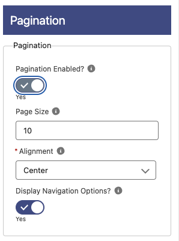

# Pagination

**Pagination Enabled**: Enable pagination of the data.
**Page Size**: Number of records to show per page.
**Alignment**: Where to show the pagination navigation, left, center or right.
**Display Navigation Options**: If enabled, the pagination options: First, Prev, Next and Last will be shown, otherwise just the page numbers.
