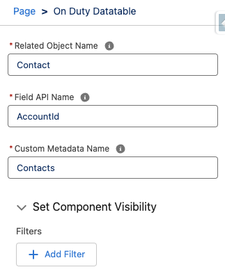

# Record Pages and Experience Cloud Pages Configuration

## Steps

1. Build the table in a Flow.
2. Use the Copy Configuration Button.
3. Go to the Custom Metadata **OD Datatable JSON Configuration**.
4. Create a new record and Paste the JSON (copied in step 2) into the Field **Table Configuration**.
5. Save and copy the Name of the Custom metadata record just created (e.g. Contacts).
6. Go to a Lightning Record Page and Drag and Drop the Component anywhere you want in the page.
7. Configure the component:
   a. **Related Object Name**: The Name of the related Object to query. Must be related to the current record.
   b. **Field API Name**: API Name of the field in the related object that links it to this record (e.g. AccountId).
   c. **Custom Metadata Name**: This is the custom metadata name that contains the configuration in JSON format (the one we built above).

**NOTE**: If you hace Save enabled, the component will add the _Field API Name_: _Current Record Id_ to every record that is being added. You do not need to specify anything for that field, the component will always add the relationship to the current record, based on the field specified in the properties.
