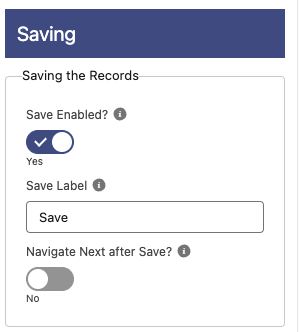

# Saving

**Save Enabled**: If enabled, a Save and Cancel buttons will appear in the table to be able to save the changes.
**Save Label**: Label to show in the Save button if save is enabled.
**Navigate Next after Save?**: If enabled, after clicking Save it will execute the Next button navigation of the screen and it will output the variable 'saveAndNext' = true. This only works in Flows.
