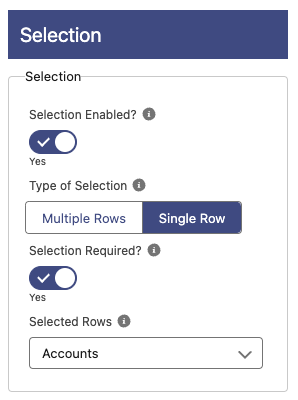

# Selection

**Selection Enabled**: If enabled a checkbox or radio button will be displayed to allow the selection of the row.

- _NOTE_: if Bulk Edit, Bulk Delete or any other Bulk Operation button are selected, then the checkbox will display regardless of this being No.

**Type of Selection**: Allow the selection of multiple rows (checkbox) or single row (radio button).

- _NOTE_: if Bulk Edit, Bulk Delete or any other Bulk Operation button are selected, then checkboxes will display regardless of this being Single Row.

**Selection Required?**: If enabled you won't be able to move forward until you select 1 row minimum
**Selected Rows**: Record Collection variable with all the rows that needs to be initially selected. This only works in Flows.
